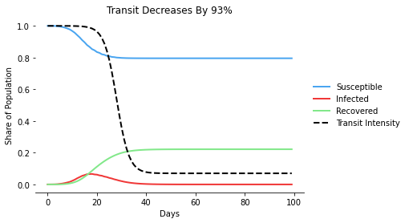
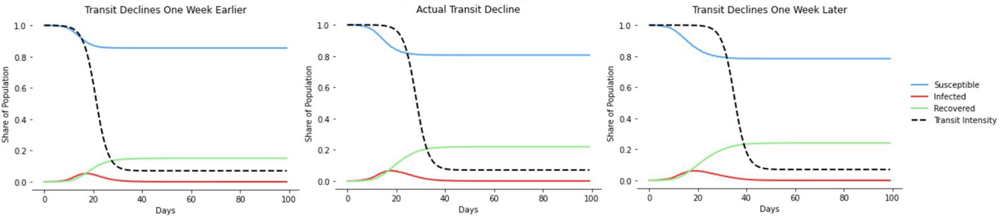

# covid-simulation

    

This is a model designed to accurately simulate the spread of COVID-19 in New York City by utilizing real transit data along with an SIR epidemiological model.  The code uses Cython and multiprocessing for fast computation.

This was developed in April 2020, shortly after cases began to spike in NYC, and it allowed for the early estimation of transmission rates amidst a lack of reliable data.

MTA transit data was used to build an origin-destination matrix, which approximates the movement of individuals throughout the city on a typical day. The incorporation of this matrix provides an additional variable that controls mobility patterns over time, and can be adjusted to simulate effects of policy decisions or social distancing. 

## Requirements
This project was developed in Python 3. The [environment.yml](https://github.com/rb2540/covid-simulation/blob/main/src/environment.yml) file can be used to create a conda environment with all the necessary packages.

## Contents
The code is contained in the following jupyter notebooks in [src](https://github.com/rb2540/covid-simulation/tree/main/src):
* [get_nyc_od_matrix.ipynb](https://github.com/rb2540/covid-simulation/blob/main/src/get_nyc_od_matrix.ipynb) generates the origin-destination matrix
* [Cython_Optimizations.ipynb](https://github.com/rb2540/covid-simulation/blob/main/src/Cython_Optimizations.ipynb) details how the code was optimized with cython and multiprocessing
* [Experiments.ipynb](https://github.com/rb2540/covid-simulation/blob/main/src/Experiments.ipynb) provides several examples of how the simulation can be used

## Example
The simulation was used to generate the following plots, which show how shutting down mass transit either one week earlier or one week later would have affected transmissions over time:

    

Shutting down one weak earlier is estimated to have reduced transmissions by about 10%.

Several other examples are provided in [Experiments.ipynb](https://github.com/rb2540/covid-simulation/blob/main/src/Experiments.ipynb). 

